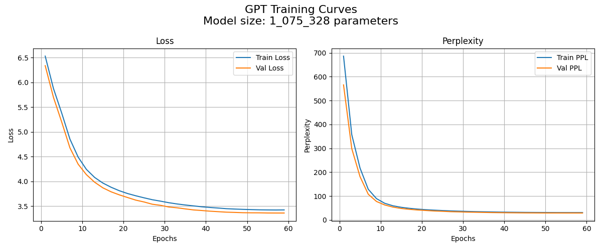

# GPT from scratch
language modeling with ngram up to simple GPT model (decoder only transformer) as described in the [Attention is all you need](https://arxiv.org/abs/1706.03762) paper. <br>

In [notebooks/](./notebooks/) you can find a guided runthrough of training and using the models, as well as analyses of the hyperparameter search. <br>

Tokenizer: <br>
- byte level bpe tokenizer [ [from scratch](./bpe_tokenizer.py) | [hf wraper](./bpe_hf.py) ] <br>
  
Models implemented:
- [Ngram model](./ngram_engine) <br>
- [Neural bigram model](./neural_bigram.py) <br>
- [GPT model (decoder only)](./GPT_mj.py) <br>

Data set: [shakespeare](./data/) <br>
- to download and preprocess the data run [clean_nltk_shakespear_data_w_nl.py](./data/clean_nltk_shakespear_data_w_nl.py) from the root (repo) directory: <br> 
  ```python clean_nltk_shakespear_data_w_nl.py``` <br>


run main to train a new <[gpt_model](./gpt_model.py).GPTModel>, by chainging the variables you can also continue the training of a pericular model. <br>
run compare models to see and compare all the models. <br>
run model_ui_gradio for visual interface (has bugs to be fixed) <br>


TODO:
 - put results here and briefly describe them. 
... 
example: <br>
Tiny-GPT training curves: <br>
 <br>

# Results

## milestones

### tokenizer
tr 'A-Z' 'a-z' < Shakespeare_clean_full.txt | tr -sc 'A-Za-z' '\n' | sort | uniq -c | sort -n -r
### ngram model

### neural bigram model

### GPT model
