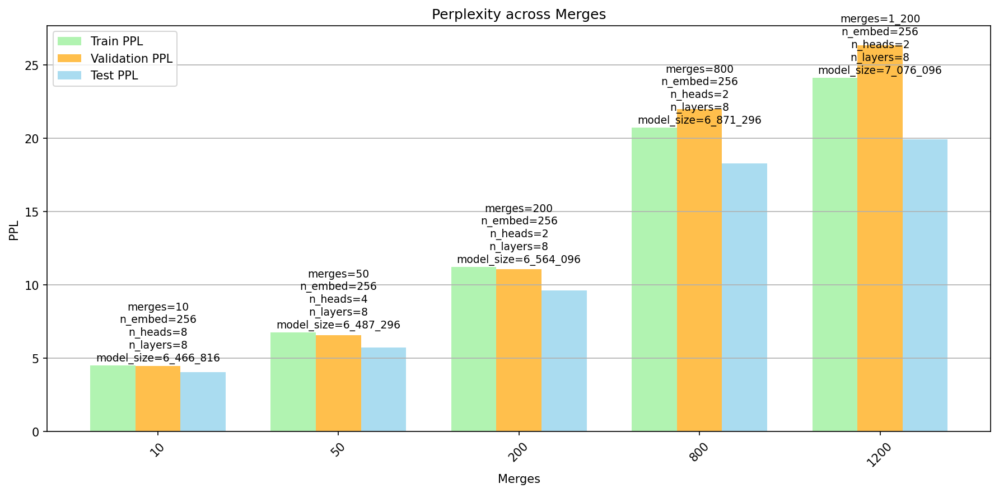

# GPT from scratch
language modeling with ngram up to simple GPT model (decoder only transformer) as described in the [Attention is all you need](https://arxiv.org/abs/1706.03762) paper. <br>

In [notebooks/](./notebooks/) you can find a guided runthrough of training, evaluating and using the models, as well as analyses of the hyperparameter search. <br>

Tokenizer: <br>
- byte level bpe tokenizer [ [from scratch](./bpe_tokenizer.py) | [hf wraper](./bpe_hf.py) ] <br>
  
Models implemented:
- [Ngram model](./ngram_engine) <br>
- [Neural bigram model](./neural_bigram.py) <br>
- [GPT model (decoder only)](./GPT.py) <br>

Data set: [shakespeare](./data/) <br>
- to download and preprocess the data run [clean_nltk_shakespear_data_w_nl.py](./data/clean_nltk_shakespear_data_w_nl.py) from the root (repo) directory: <br> 
  ```python clean_nltk_shakespear_data_w_nl.py``` <br> <br>

[Training scripts](./train.py) <br>
[Hyperparameter search scripts](./hparam_search.py) <br>

# Results and Milestones

## Overall model-type comparison

comparison of the three model types (ngram, neural bigram, gpt) on the heldout test data set. <br>

Perplexity is used as the evaluation metric. <br>
$$
  ppl = exp({H(p)}) = exp({-\frac{1}{N} \sum_{i=1}^{N} \log p(x_i)})
$$

where H(p) is the sum-cross-entropy (i.e negative log likelihood) of the model distribution p and the true data distribution. <br>


[model-type comparison notebook](./notebooks/compare_model_performance.ipynb) <br>

 <br>


## Unix
One liner to get a simple word level tokens and unigram counts: <br>

```
tr 'A-Z' 'a-z' < data/Shakespeare_clean_train.txt | tr -sc 'A-Za-z' '\n' | sort | uniq -c | sort -n -r > data/Shakespeare_word_unigram_counts_train.txt
```

## tokenizer
[BPE tokenizer from scratch](./bpe_tokenizer.py) <br>
[BPE tokenizer huggingface wrapper](./bpe_hf.py) <br>
[tokenizer notebook](./notebooks/ngram.ipynb) <br>

Byte-Pair encoding (BPE) tokenizer with different number of merges (vocab size = 256 + #merges). <br> <br>

 <br>

### analysis results

#### Heaps K vs. merges

- Shows the Heaps’ law constant  𝐾, which reflects vocabulary growth.
- Higher 𝐾 at low merges means many unique tokens; it drops as merges increase.

#### Heaps β vs. merges

- Displays the Heaps’ law exponent β, measuring how fast vocab grows with corpus size.
- β rises with merges, stabilizing at higher values. 

#### Utilization vs. merges

- Fraction of learned vocab used in validation set.
- Peaks at moderate merges (800-1200), then declines as vocab becomes too large and sparse.

#### Chars per token vs. merges

- Average number of characters per token.
- Increases with merges (tokens become longer), starts to saturate around 1k merges.

#### Compression ratio vs. merges

- Ratio of model text size (bypes) to raw text.
- Improves (higher compression) with more merges, steapest slop up to 2.5k merges, saturates after ~8–10k merges.

#### Tokens per 1k chars vs. merges

- Average number of tokens needed per 1k characters.
- Decreases with merges, showing more compact representation, starts to saturate around 1k merges.

### General takeaway

- Low k (k < 800): small vocab, low to decent utilization, high compression, heaps K high (many unexplored tokens), heaps β low (slow vocab growth).

- High k (k > 1200): large vocab, lower utilization, lower compression, heaps K low (few new tokens), heaps β high (fast vocab growth).

- Optimal range (~800–1200 merges, green lines): balances efficiency and utilization, and expected vocab growth.

</br>

## N-Gram model

[N-gram model](./ngram_engine.py) <br> 
[N-gram model and hyperparameter search notebook](./notebooks/ngram.ipynb) <br>


### Model description

N-gram language model with k-smoothing (k=1 default) and linear interpolation of different N-grams (unigram to (N)-gram).
- input: (block size) tensor of integers (token indices)
- output: (vocab size) tensor of probabilities for the next token based on the n-grams probabilities and the learned interpolation weights (lambdas). <br>

the interpolation weights (lambdas) are fitted with expontiated gradient descent on the validation set. <br>

### Hyperparameter search analysis

Hyperparameter search with grid search over:
- number of merges (~vocab size)
- N (max n-gram order)

 <br>

#### Interpolation Weights (top-left):

- The heatmap shows the learned λ-weights for combining different N-grams.
- for small vocab sizes (merges < 500), chars per token < 1.5, the weights disrtribution favors middle-sized N-grams (N=2-5), while for larger vocab sizes (merges > 500), most of the weight shifts to the unigram and bigram models (N=1-2).
- -> Larger vocabularies lead to sparser data (espically with small datasets), making higher-order N-grams less reliable, so the model relies more on unigrams and bigrams.

#### Validation PPL & BPT (top-middle & top-right):

- Both perplexity (PPL) and bits-per-token (BPT) increase steadily as the number of merges grows, meaning larger vocabularies make the N-gram model less predictive and less efficient. The best results are achieved with relatively small merges and moderate N (≈4–5), where PPL and BPT reach their lowest values.

#### Bottom row (Chars per Token, Validation PPL, Validation BPT vs. Merges):

- All three curves confirm the same trend: merges produce longer tokens, but at the cost of higher perplexity and BPT. This shows that for N-gram models, smaller vocabularies provide better predictive power and efficiency, while large vocabularies lead to diminishing returns.

#### Takeaway

- Too few merges → overly fragmented tokens; too many merges → inefficient and poor generalization.
  
- Small to medium merges (≈50–800) with N=4–5 yield the best trade-off between perplexity and efficiency.


### Test results

 <br>

- Perplexity increases sharply with the number of merges for train, validation, and test sets alike. The best performance (lowest PPL ≈ 7–8) is achieved with very few merges (k=10). At higher merges (k > 800), perplexity rises strongly, reaching >60 at k=800, indicating that larger vocabularies significantly reduce the predictive quality of the N-gram model.


### Text generation examples

Examples (given context: “shall the lovers”):

- merges=10, n=9, lambdas ≈ [~0, ~0, 0.395, 0.605, ~0, ~0, ~0, ~0, ~0]: <br> 
  
(fragmented nonsense)
```
>>>> 
shall the lovers
--------------------
<<<<
?
Antony with tim.
Marchoice,
Alare I'll drance,
Andeed prime


Meeds affore me, I drophese?
An now, with 
```

</br>

- merges=200, n=9, lambdas ≈ [~0, 0.541, 0.459, ~0, ~0, ~0, ~0, ~0, ~0]: <br>

```
>>>> 
shall the lovers
--------------------
<<<<
Sce Yound,
And their cou know, I cangain, I dice,
BERCAPULET
MItulavene of my chan that the from the take theyes; and eart.


Exe to be satter;
Faphount all my let,
But to be a riev
```

</br>

- merges=800, n=9, lambdas ≈ [~0, 1.000, ~0, ~0, ~0, ~0, ~0, ~0, ~0]: <br>

```
>>>> 
shall the lovers
--------------------
<<<<
bese Wheo be senter. If welieceiveder


And in that we may be,

Servant


Ifabinion,


Thange thee?
BRUTUS
H
Thisonst your dutio is a turn.
SCOrongue on your corattle;


What you, and
C
```


## Neural bigram model

[neural bigram model](./neural_bigram.py) <br>
[neural bigram model notebook](./notebooks/neural_bigram.ipynb) <br>
[neural bigram model hparam search notebook](./notebooks/neural_bigram_hparams.ipynb) <br>


### Model description

The neural bigram model is a simple feedforward ANN with only an embedding layer (vocab size x vocab size matrix) it maps each token to a vector of logits for the next token. <br>
- input: (batch size, block size) tensor of integers (token indices)
- output: (batch size, block size, vocab size) tensor of logits for the next token of each input token
  - loss is computed seperately outside the model call
- loss: cross entropy loss between the logits and the true next token indices
- regularization: weight decay and dropout on the embedding layer. <br>

the model is trained using mini-batch stochastic gradient descent (SGD) or AdamW optimizers. <br>
the training also includes learning rate scheduling (warmup and cosine decay).

### Training curve

 <br>

### Hyperparameter search analysis
Hyperparameter search with grid search over:
- number of merges (~vocab size)
- learning rate
- dropout

 <br>

- lr, followed by number of merges has the most significant impact on the model performance (validation ppl), dropout effect is farily negligible  <br>
- lr of 3e-4 did significantly worse and with higher variance than the other two faster lrs (1e-2 and 1e-3), which performed similarly well. <br>
- zero dropout seems to perform best, but the effect is not very significant. <br>
- generelization gap (train vs. validation ppl) decreases with increasing merges although with higher variance. <br>

### Test results

 <br>

- Perplexity increases with the number of merges (~vocab size) but significantly less steeply than for the ngram model. <br>

### Text generation examples
merges=10, lr=3.000000e-02, dropout=0.0 | model size: 72900 <br>
Test PPL: 13.78, val PPL: 14.25, train PPL: 14.040
```
>>>> shall the lovers
--------------------
<<<< el ndy I ue g idir d shaingrainthes ighis ingadalinn me,
```

- merges=200, lr=3.000000e-02, dropout=0.0 | model size: 211600 <br>
Test PPL: 27.11, val PPL: 31.04, train PPL: 28.088

```
>>>> shall the lovers
--------------------
<<<<  and my luevery come to dry of again
CAses the sou are cossiod awns
LLook, and dot,
AC
```

- merges=800, lr=3.000000e-02, dropout=0.0 | model size: 1123600 <br>
Test PPL: 33.15, val PPL: 46.22, train PPL: 31.990

```
>>>> shall the lovers
--------------------
<<<<  the glessench'd
We of this?
BENCE
HARI will beaster
Noor, sir;
They, to being without his own hazooths of
```

## GPT model

[GPT model](./GPT.py) <br>
[GPT model notebook](./notebooks/GPT.ipynb) <br>
[GPT model hparam search notebook](./notebooks/GPT_hparams.ipynb) <br>

### Model description

The GPT model is a decoder only transformer model as described in the [Attention is all you need](https://arxiv.org/abs/1706.03762) paper. <br>

the model consists of (DECODER ONLY): <br>

- input embedding (vocab size x embedding size )
- positional encoding (fixed) (block_size x embedding size)
- dropout
- multiple transformer blocks (embedding size x embedding size)
- layer normalization (embedding size x embedding size)
- output linear layer (embedding size x vocab size)

 <br>

the transformer block consists of:

- multi-head self-attention layer (embedding size x embedding size)
- layer normalization (embedding size x embedding size)
- feedforward layer (embedding size x 4*embedding size x embedding size)
- layer normalization (embedding size x embedding size)
- residual connections (used around the attention and feedforward layers)
- dropout

 <br>

here we use scaled dot-product attention with causal masking (decoder block). <br>
- causal masking, i.e. each token can only attend to previous tokens and itself (no peeking into the future) <br>
- scaling by 1/sqrt(d_k) to prevent large dot-product values which can lead to small gradients (softmax saturation) <br>

 <br>

- input: (batch size, block size) tensor of integers (token indices)
- output: (batch size, block size, vocab size) tensor of logits for the next token of each input token
  - loss is computed seperately outside the model call
- loss: cross entropy loss between the logits and the true next token indices
- regularization: weight decay and dropout on the embedding layer and transformer blocks. <br>
  
the model is trained using mini-batch AdamW optimizer and learning rate scheduling (warmup and cosine decay). <br>


### Training curve

 <br>

### Hyperparameter search analysis

Hyperparameter search with grid search over:
- number of merges (~vocab size)
- embedding dimension
- number of attention heads
- number of transformer blocks / layers


 <br>

- number of merges (~vocab size) and  embedding dimension have the most significant impact on the model performance (validation ppl), while the number of layers had smaller effect, this hint that (at least for the small dataset) investing in larger embedding dimension is more beneficial than deeper layers. <br>
It could be that our embedding dimensions are still too small to fully utilize the depth of the model, hence the effect of deeper models could not be fully observed. <br>

- number of attention heads had the least effect on the model performance, again this could be due to the small embedding dimensions used in the search (max 256).

- generelization gap (train vs. validation ppl) got better increassed model sized and vocab size, i.e. larger models generalized better. this concludes that there were no overfitting and that there is still some space for bigger models than the ones tested here for the given task. This conforms to the previous two points. <br>

- takeaway: for our small dataset, investing in larger embedding dimensions is more beneficial than deeper models up to the tested embedding dimensions.

### Test results

 <br>

- Across all merge sizes (~vocab sizes), the best performing gpt models have the maximum embedding dimension (256) and number of layers (8).
  
- Prefered number of attention heads decreased steadily with increasing merges, from 8 heads (max tested) at 10 merges and 4 at 50 merges (both being character level tokens), to 2 heads for all larger merges (200 - 1200).
  
### Text generation examples

merges=10, n_embed=256, n_heads=8, n_layers=8, lr=3.000000e-04, dropout=0.2 | model_size: 6466816 <br>
Test PPL: 4.06, val PPL: 4.49, train PPL: 4.532036304473877 <br>

```
>>>> shall the lovers
--------------------
<<<<  give. Being cause shame ducatch;
Her much spads to gre
```

<br>

merges=200, n_embed=256, n_heads=2, n_layers=8, lr=3.000000e-04, dropout=0.2 | model_size: 6564096 <br>

Test PPL: 9.62, val PPL: 11.10, train PPL: 11.244375228881836 <br>
```
>>>> shall the lovers
--------------------
<<<< 
Cred in a ground.


ROMEO
To sevolatified to wise him,
And some people.
```

<br>

merges=800, n_embed=256, n_heads=2, n_layers=8, lr=3.000000e-04, dropout=0.2 | model_size: 6871296 <br>

Test PPL: 18.29, val PPL: 22.01, train PPL: 20.74727439880371 <br>

```
>>>> shall the lovers
--------------------
<<<< 
Than that be appar'd for my life, or no more to the king
And that which my lord, for you would do bange thee so
That I have told them fellow and rep
```

## Qualitative analysis of generated text

| Model             | k=10 (few merges)                                             | k=200 (moderate merges)                                               | k=800 (many merges)                                                                |
| ----------------- | ------------------------------------------------------------- | --------------------------------------------------------------------- | ---------------------------------------------------------------------------------- |
| **N-gram**        | Very short tokens → fragmented nonsense; many nonsense words. | More real words; partial structure; grammar unstable.                 | Fluent words and names, but coherence breaks down quickly.                         |
| **Neural bigram** | Mostly gibberish; rarely any real words.                      | Few real words; no coherent structure.                                | Some real words, but still largely nonsensical.                                    |
| **GPT**           | Mostly real words; some short phrases; limited coherence.     | Mostly real words; some short phrases; limited grammar and coherence. | Rarely any nonsense words; longer phrases; some grammar; a few coherent sentences. |
